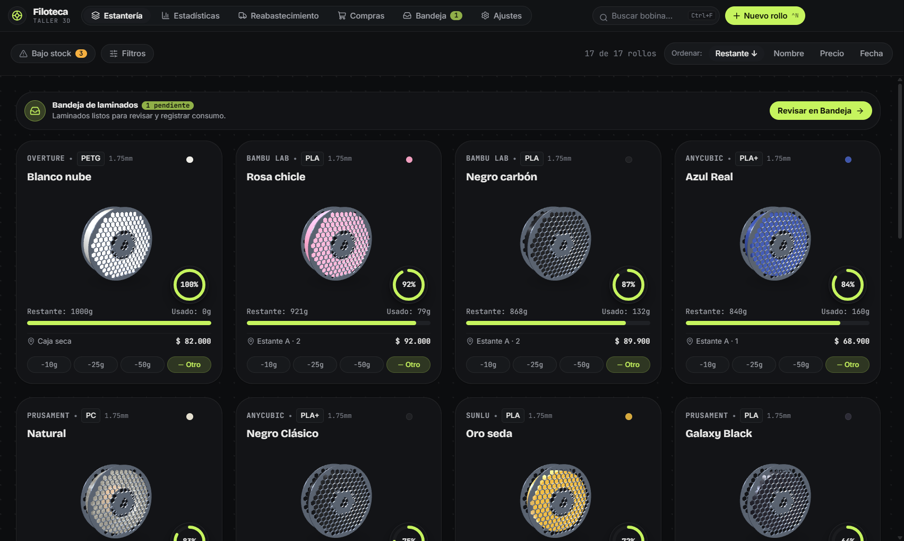
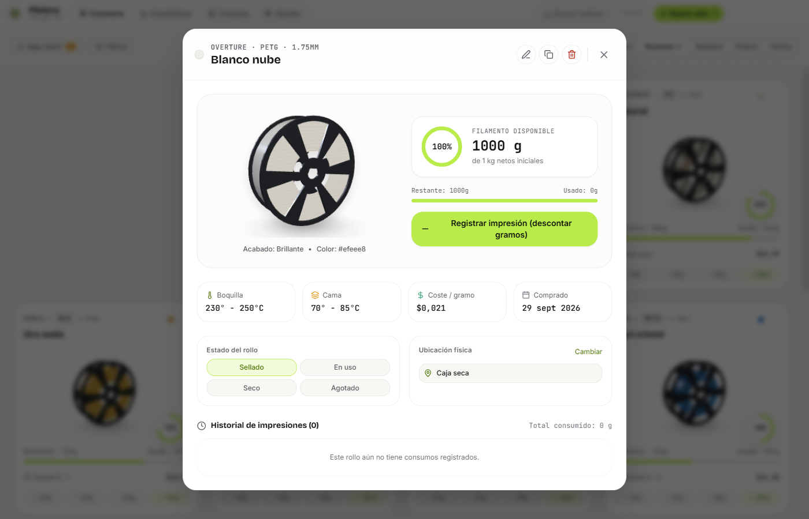
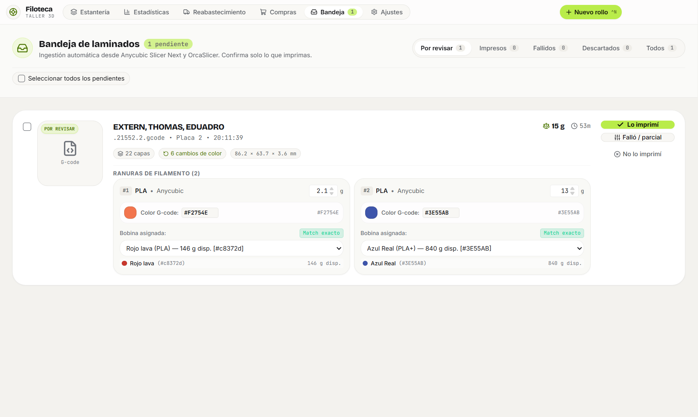
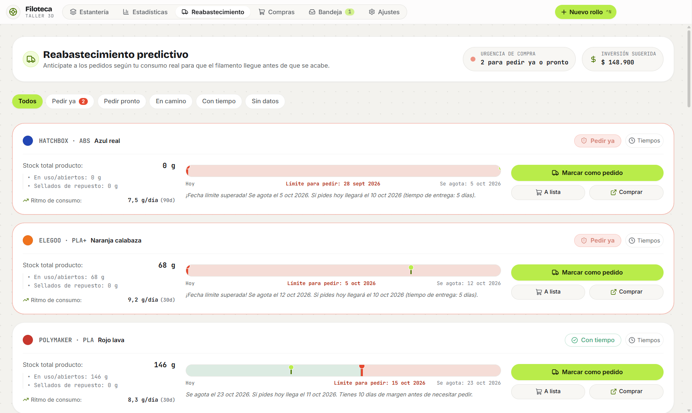

# Filoteca

[🇺🇸 Read in English](README.md) | [🇨🇴 Leer en Español]

> Sistema de gestión e inventario de filamento para talleres de impresión 3D. Aplicación de escritorio 100% offline para Windows con modelos 3D paramétricos, integración con Anycubic Slicer Next y OrcaSlicer, soporte multi-idioma (Español, English, Português) y cálculo de costes en tiempo real.

[-blue.svg)](#descarga-e-instalación-rápida)
[](LICENSE)
[](#arquitectura-técnica)
[](https://github.com/Mate1592/FILOTEK_ANYCUBIC/releases)

---

## Capturas de Pantalla

### Estantería Principal con Bobinas 3D


### Inspección Táctil 360° y Detalle de Bobina


### Companion Automático de Laminador (Anycubic / Orca)


### Planificación y Previsión de Reabastecimiento


---

## Características Principales

### 1. Modelado 3D Paramétrico con Renderizado Eficiente
- **Física real de devanado:** El radio del filamento responde al volumen auténtico:
  $$R = \sqrt{r_{\text{núcleo}}^2 + f \cdot (R_{\text{lleno}}^2 - r_{\text{núcleo}}^2)}$$
  donde $f = \frac{\text{peso restante}}{\text{peso inicial}}$. Un carrete con 300g refleja físicamente un tercio del devanado, mostrando el cilindro de cartón kraft interior a través de la celosía hexagonal.
- **Materiales PBR realistas:** Configuraciones calibradas para acabados mate, brillante, seda (sheen nacarado), translúcido y glitter.
- **Rendimiento optimizado a 30 FPS:** Arquitectura de canvas WebGL compartido con renderizado bajo demanda (*scissor testing*). En reposo el consumo de GPU cae al **0%**, eliminando sobrecargas térmicas en monitores de alta frecuencia (120Hz, 144Hz o 240Hz).

### 2. Companion de Laminador (Anycubic Slicer Next y OrcaSlicer)
- **Filosofía "Laminar no es imprimir":** Filoteca no descuenta filamento a espaldas del usuario. Detecta de forma pasiva los archivos generados y presenta una bandeja interactiva para confirmar únicamente lo que se imprimió.
- **Detección en segundo plano:** Vigilante de archivos temporales (`%LOCALAPPDATA%\Temp\anycubicslicer_model\`) que extrae miniaturas PNG embebidas, ranuras de material, tiempos y pesos estimados.
- **Algoritmo colorimétrico CIELAB (CIE76):** Transforma los colores sRGB del laminador al espacio perceptual $L^*a^*b^*$ y empareja automáticamente las ranuras con la bobina más cercana de tu inventario.

### 3. Lógica Inteligente de Stock de Respaldo (`hasBackupStock`)
- Si una bobina está por debajo del umbral de reserva (ej. 40g), pero en el taller existe otro rollo sellado del mismo material y color, la aplicación muestra una insignia de tranquilidad (*"4% · Respaldado"*), evitando falsas alarmas en la estantería y en la lista de compras.

### 4. Soporte Multi-idioma y Tour de Bienvenida
- Soporte nativo para **Español**, **English** y **Português**.
- Tour interactivo de configuración inicial para seleccionar idioma, moneda del taller (COP, USD, EUR, BRL) y tema visual (oscuro o claro).

### 5. 100% Offline y Privado
- Motor de base de datos SQLite embebido en WebAssembly (`sql.js`). Todos tus datos, precios, historial de consumo y notas residen exclusivamente en tu disco local. No requiere cuentas ni conexión a internet.

---

## Descarga e Instalación Rápida

No es necesario compilar código ni instalar herramientas de desarrollo:

1. Ve a la pestaña de **[Releases](https://github.com/Mate1592/FILOTEK_ANYCUBIC/releases)** en este repositorio.
2. Descarga el archivo **`Filoteca-Portable-1.0.0.exe`**.
3. Haz doble clic sobre el archivo ejecutable para iniciar Filoteca de inmediato. Puedes llevarlo en una memoria USB o dejarlo en tu carpeta de herramientas.

---

## Comunidad y Participación

- **Dudas, ideas y fotos de talleres:** Participa en [GitHub Discussions](https://github.com/Mate1592/FILOTEK_ANYCUBIC/discussions) para compartir mejoras y configuraciones de impresión.
- **Reporte de errores:** Abre un [GitHub Issue](https://github.com/Mate1592/FILOTEK_ANYCUBIC/issues) detallando el problema o sugiriendo nuevas marcas de filamentos.

---

## Apoyo y Donaciones

Filoteca es un proyecto de código abierto desarrollado para la comunidad de impresión 3D y makers de todo el mundo. Si esta herramienta te ahorra tiempo y material en tu taller, puedes apoyar su mantenimiento y evolución continua:

### Donaciones Nacionales (Colombia 🇨🇴)
- **Link de Pago (Bold / Wompi / PSE / Nequi / Tarjetas):**
  Puedes realizar tu aporte directamente a través de pasarela segura colombiana:
  [checkout.wompi.co/l/miKi8F](https://checkout.wompi.co/l/miKi8F)
- **PayPal:** [paypal.me/matec15](https://paypal.me/matec15)
- **Ko-fi:** [ko-fi.com/mate1592](https://ko-fi.com/mate1592)

---

## Desarrollo y Compilación Local

Si deseas contribuir o compilar el proyecto desde el código fuente:

### Requisitos
- Windows 10 u 11 (64-bit).
- Node.js LTS (v20 o superior).

### Instrucciones
```powershell
# 1. Instalar dependencias
npm install

# 2. Iniciar en modo desarrollo con HMR
npm run dev

# 3. Ejecutar pruebas unitarias de metadatos G-code
npm run test:gcode

# 4. Compilar versión portable de Windows (.exe)
npm run dist:portable
```

---

## Licencia

Distribuido bajo la Licencia MIT. Consulta el archivo `LICENSE` para más detalles.
